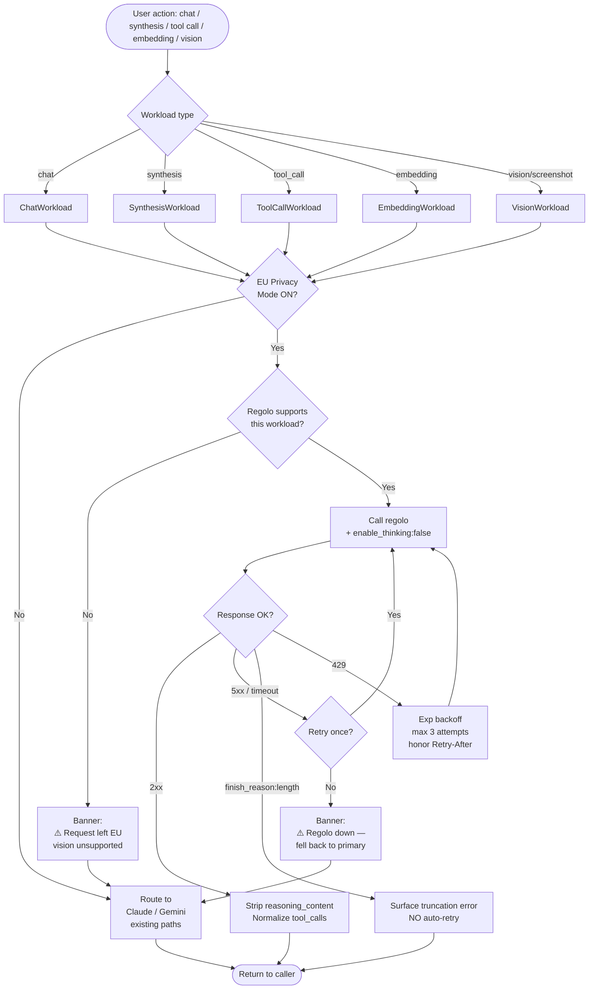
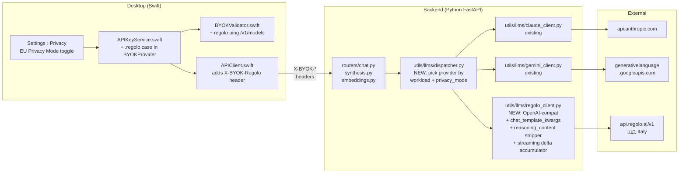
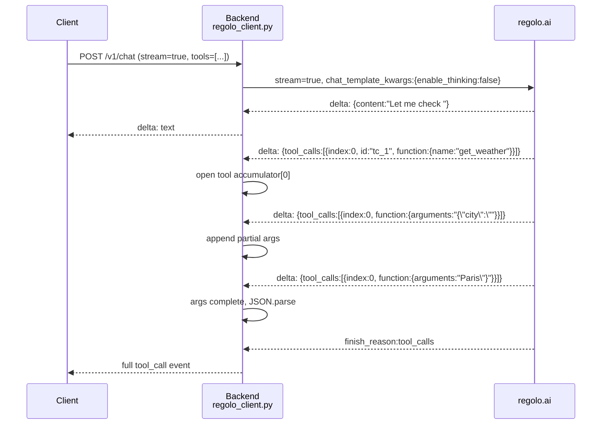

# Regolo.ai Integration — EU Privacy Mode

## Overview

Adds [regolo.ai](https://regolo.ai) as a third LLM provider path alongside the existing Anthropic (Claude) and Google (Gemini) paths. Regolo is an Italy-hosted, OpenAI-compatible inference platform with a stated zero-retention, GDPR-compliant posture — routing Omi's LLM traffic through it lets us offer an "EU Privacy Mode" in which chat, synthesis, tool-calling, and embedding workloads stay in European infrastructure.

**Status (Apr 2026):** scoped, not yet implemented.
**Author:** synthesis from `/octo:research` + `/octo:define` (Claude + Codex + Gemini consensus).

## Research context

Regolo.ai exposes OpenAI-compatible endpoints at `https://api.regolo.ai/v1` and hosts ~19 open-source models. Live probes against the production API confirmed:

| Capability | Model | Result |
|---|---|---|
| Auth + models list | `GET /v1/models` | ✓ |
| Tool calling | `Llama-3.3-70B-Instruct` | ✓ clean OpenAI-compat `tool_calls`, bonus `reasoning_content` field |
| Embeddings | `Qwen3-Embedding-8B` | ✓ 4096-dim |
| Chat (thinking model) | `minimax-m2.5` | ✓ **requires** `chat_template_kwargs:{enable_thinking:false}`; else `content:null, finish_reason:length` |
| Structured JSON extraction | `qwen3.5-122b` | ✓ same thinking caveat; clean JSON with thinking off |
| Vision | `qwen3-vl-32b` | ⚠️ listed in some tiers only — availability uncertain on PAYG |

**Pricing (Apr 2026):** per 1M tokens input/output — `minimax-m2.5` €0.60/€3.80, `Llama-3.3-70B-Instruct` €0.60/€2.70, `qwen3.5-122b` €1.00/€4.20, `qwen3.5-9b` €0.07/€0.35. Roughly 15–25 % of Claude Sonnet's rate for equivalent workloads.

## Scope

**In:** additive OSS-via-regolo path for chat, synthesis, tool calling, embeddings. Desktop settings toggle, backend routing, telemetry, error semantics.

**Out:** replacing Claude/Gemini, fine-tuning, self-hosted models, custom GPU deployments on regolo, admin-issued regolo keys (BYOK only day 1).

## Architectural decisions

### EU Privacy Mode — global toggle, not per-workload

One settings-level toggle flips chat + synthesis + tool-call + embedding workloads to regolo. Per-workload overrides live behind an "Advanced" disclosure and are disabled while Privacy Mode is on. Rationale: one simple mental model beats five independent provider pickers; the "force all" framing matches what users expect from a privacy guarantee.

### Fallback behavior — preferred, not airlocked

When Privacy Mode is on and a request cannot be served by regolo (vision unsupported, 5xx outage, persistent 429), the request falls back to the primary provider **with a visible banner** (`⚠️ This request left the EU — vision unsupported / outage`). This is a deliberate design choice: strict airlock behavior would disable too many features silently. Users who want hard airlock can disable the affected feature manually.

### Thin custom adapter, not LiteLLM

Regolo needs provider-specific request shaping (`chat_template_kwargs.enable_thinking`, `reasoning_content` stripping, streaming tool-delta accumulator). LiteLLM would smooth these away. A ~200-LOC `regolo_client.py` next to the existing `claude_client.py` and `gemini_client.py` preserves the feature control.

### Streaming tool calls

Day 1 ships with full streaming including tool_calls delta accumulation. The accumulator holds partial `tool_calls[i].function.arguments` chunks until `finish_reason` fires. Live probe to confirm regolo's exact delta shape is the first Phase 1 dev task.

## Request flow



## Component layout



## Dispatcher decision table

| Privacy Mode | Workload | Regolo supports? | Route → | Banner? |
|---|---|---|---|---|
| OFF | any | — | existing Claude/Gemini | no |
| ON | chat | ✓ | `regolo: minimax-m2.5` | no |
| ON | synthesis | ✓ | `regolo: Llama-3.3-70B-Instruct` | no |
| ON | tool_call | ✓ | `regolo: Llama-3.3-70B-Instruct` | no |
| ON | ChatLab grade | ✓ | `regolo: qwen3.5-9b` | no |
| ON | embedding | ✓ | `regolo: Qwen3-Embedding-8B` | no |
| ON | vision | ✗ (no qwen3-vl on PAYG) | `gemini: gemini-3-flash-preview` | ⚠️ left EU |
| ON | regolo 5xx (after 1 retry) | temp no | fall back to Claude/Gemini | ⚠️ outage, left EU |
| ON | regolo 429 | yes with backoff | regolo (3 attempts) | no |

## Streaming tool-call sequence



## Functional requirements (Day 1)

| # | Requirement |
|---|---|
| F1 | Add `.regolo` case to `BYOKProvider` in `APIKeyService.swift` with `X-BYOK-Regolo` header + `dev_regolo_api_key` storage key |
| F2 | Extend `BYOKValidator.swift` to ping `GET https://api.regolo.ai/v1/models` with `Authorization: Bearer <key>` |
| F3 | Backend accepts `X-BYOK-Regolo` and routes via `OSSProvider` client (`base_url=https://api.regolo.ai/v1`) |
| F4 | Day-1 model map: `chat → minimax-m2.5`, `synthesis → Llama-3.3-70B-Instruct`, `chatLabGrade → qwen3.5-9b`, `embedding → Qwen3-Embedding-8B` |
| F5 | All non-reasoning calls inject `chat_template_kwargs:{"enable_thinking":false}` |
| F6 | Tool-call responses normalize to the existing internal shape; `reasoning_content` stripped before persistence |
| F7 | Embedding responses normalize to the existing interface (4096-dim) |
| F8 | Existing Claude/Gemini/OpenAI/Deepgram BYOK paths unchanged — zero regressions |

## Non-functional requirements

| Category | Requirement |
|---|---|
| Latency | P50 ≤ 2 s synthesis, ≤ 1.5 s first-token streaming chat. Routing overhead ≤ 20 ms. Client timeout 30 s, retry once on network error, no retry on 4xx. |
| Error mapping | Regolo errors → existing `LLMProviderError` categories (auth / rate_limit / capability / truncation / network). |
| Telemetry | Log `provider, workload, model, status, latency_ms, retry_count, fallback_used, finish_reason`. Never log prompts, completions, keys, embeddings, tool args. |
| Privacy indicators | Status-bar shield icon when Privacy Mode is active. Fallback banner shown per request that left the EU; dismissible per-request, not permanently silenceable. |
| Reliability | Regolo failures must not corrupt session state; streaming partial output must be discardable. |

## Settings UX

```
┌─ Settings › Privacy ─────────────────────────────────┐
│  [🛡] EU Privacy Mode                         [ ● ]  │
│   All AI runs on regolo.ai (Italy, zero retention).  │
│   Vision features require non-EU provider.          │
│                                                      │
│  ▸ Advanced (per-workload override)                  │
│    — Disabled while Privacy Mode is on —             │
└──────────────────────────────────────────────────────┘
```

- First-run prompt only surfaces for EU-locale users or users who open Privacy settings — avoid evangelism.
- Banner copy when fallback fires: `⚠️ This request left the EU: vision is unsupported by regolo`. Styled red, dismissible per request. Count surfaced in settings ("12 requests fell back this week").

## Edge cases — decided behaviors

| Case | Behavior |
|---|---|
| Model 404 (e.g. `qwen3-vl-32b` missing from plan tier) | Fail fast with `ERR_PROVIDER_CAPABILITY_MISSING`; feature disabled in UI with tooltip. No silent cross-provider fallback unless Privacy-Mode fallback rules apply. |
| `finish_reason:"length"` on thinking model | Surface truncation error; **do not auto-retry**. For synthesis, always send `enable_thinking:false` so this is rare. |
| Malformed tool-call JSON | Attempt existing repair flow. If it fails, return `tool_call_parse_error`; do NOT execute tools speculatively. |
| 429 rate limit | Respect `Retry-After` header; bounded exponential backoff (max 3 attempts, jitter). |
| Streaming failure before first token | Retry once non-streaming. |
| Streaming failure after first token | Propagate to caller; do not retry. |
| Reasoning content leak | Strip `reasoning_content` before writing to chat history. Optionally expose as collapsible "thinking" disclosure in UI. |
| Factual hallucination (e.g. MiniMax confused about regolo's HQ in live probe) | Chat workloads needing grounding route through existing RAG pipeline — don't trust OSS chat for factual claims. |

## Migration & history portability

- Normalized internal schema for tool calls; provider-specific IDs (`chatcmpl-tool-…`) are optional metadata.
- Switching provider mid-session preserves history; messages re-translated to the target provider's format at request time.
- Unsupported message parts (images, Anthropic cache markers) are downgraded / omitted with a visible warning, not silently dropped.
- Embedding store uses `(provider, model)` composite key so 4096-dim Qwen3 embeddings don't collide with `gemini-embedding-001` vectors. No retro-reembed; existing embeddings keep their original provider tag.

## Acceptance criteria (QA-observable)

1. Desktop settings shows regolo provider row with key field, "Test connection" button, and test result (✓ / ✗ with error reason).
2. Flipping "EU Privacy Mode" on routes chat messages to `minimax-m2.5` — verified by telemetry showing `provider=regolo, model=minimax-m2.5`.
3. Synthesis workload (e.g. Gmail summary) produces valid JSON output using `Llama-3.3-70B-Instruct`.
4. Tool-call flow ("create a reminder for tomorrow at 3pm") triggers `tools` with `tool_choice:auto`, receives a valid `tool_calls` response, and executes the reminder.
5. Memory embedding + retrieval works end-to-end with `Qwen3-Embedding-8B` (4096-dim).
6. With Privacy Mode ON, network capture confirms zero traffic to `anthropic.com` / `googleapis.com` / `openai.com` **except** for explicit fallback cases which emit the banner.
7. Unsupported vision feature (when `qwen3-vl-32b` unavailable) falls back to Gemini with the red banner.
8. `finish_reason:"length"` response surfaces as user-visible truncation warning, not a crash.
9. Existing Claude/Gemini BYOK regression suite passes unchanged.
10. Log sampling shows no API keys, no raw prompts, no raw completions at normal verbosity.

## Open questions — status

| # | Question | Status |
|---|---|---|
| 1 | Regolo tools schema matches OpenAI strict? | ✓ Resolved via live probe — Llama-3.3 returns standard `tool_calls`. |
| 2 | Is `qwen3-vl-32b` production-available? | ⚠️ Open — missing from PAYG `/v1/models`. Need regolo support ticket / plan-tier confirmation. Day 1 ships without vision on regolo. |
| 3 | Vision endpoint shape | Deferred to Phase 2. |
| 4 | Embedding dimensionality | ✓ 4096 (live probe). DB schema must support variable `embedding_dim`. |
| 5 | Is `enable_thinking` in body or header? | ✓ Body, under `chat_template_kwargs.enable_thinking`. |
| 6 | Privacy Mode forces or defaults? | ✓ **Forces** all supported workloads; per-workload overrides disabled while on. |
| 7 | Fallback allowed while Privacy Mode on? | ✓ **Yes, with visible red banner** per request. Preferred-by-default, not airlocked. |
| 8 | Rate-limit tuning vs plan tier | Open — instrument telemetry in Phase 1; revisit plan choice with real usage data. |
| 9 | Streaming parity for tool-call deltas | Open — first Phase 1 dev task is a live probe of regolo's streaming delta shape. |

## Files touched (estimated)

| File | Change | LOC |
|---|---|---|
| `desktop/Desktop/Sources/APIKeyService.swift` | `.regolo` case + storage/header/display | ~20 |
| `desktop/Desktop/Sources/BYOKValidator.swift` | regolo ping | ~10 |
| `desktop/Desktop/Sources/APIClient.swift` | `X-BYOK-Regolo` header | ~5 |
| `desktop/Desktop/Sources/ModelQoS.swift` | regolo model IDs | ~15 |
| `desktop/Desktop/Sources/SettingsPrivacyView.swift` (NEW) | toggle + banner surface | ~80 |
| `backend/utils/llms/regolo_client.py` (NEW) | OpenAI-compat client + accumulator + stripper | ~200 |
| `backend/utils/llms/dispatcher.py` (NEW) | workload + privacy_mode → provider | ~80 |
| `backend/routers/{chat,synthesis,embeddings}.py` | dispatcher integration | ~40 |
| `backend/tests/unit/test_regolo_client.py` (NEW) | normalization, streaming, error mapping | ~150 |
| `backend/tests/integration/test_dispatcher.py` (NEW) | Privacy Mode routing | ~100 |
| **Total new** | | **~700 LOC** |

Budget: **3–4 days** (1 backend, 1 desktop, 1 tests + polish, 1 integration / buffer).

## References

- [regolo.ai homepage](https://regolo.ai/)
- [docs.regolo.ai](https://docs.regolo.ai/)
- [regolo.ai pricing](https://regolo.ai/pricing/)
- Live API probes: `GET /v1/models`, `POST /v1/chat/completions` (MiniMax, Llama 3.3), `POST /v1/embeddings` (Qwen3-Embedding-8B) — Apr 22 2026.
- Internal: `/octo:research` output + `/octo:define` consensus (Claude + Codex + Gemini).
